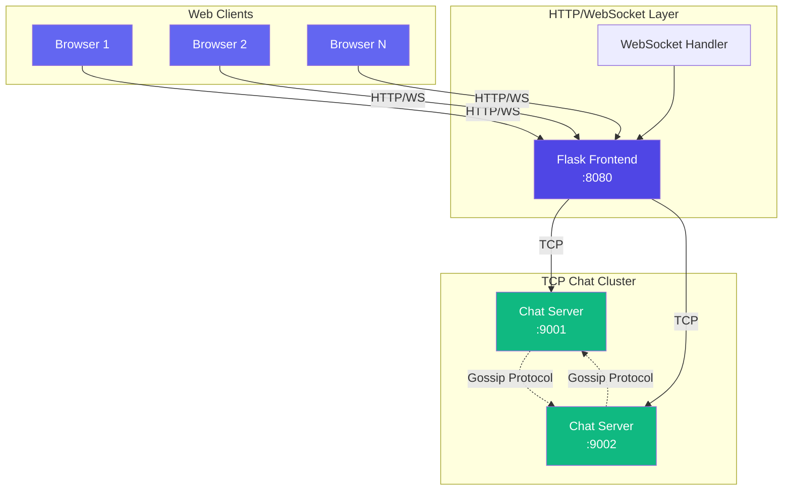
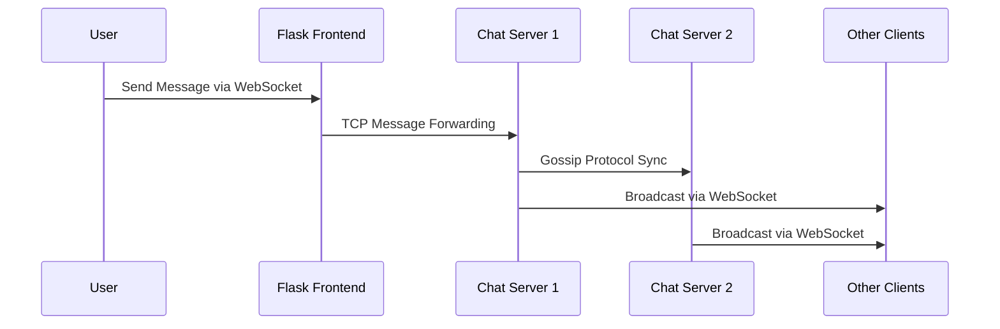
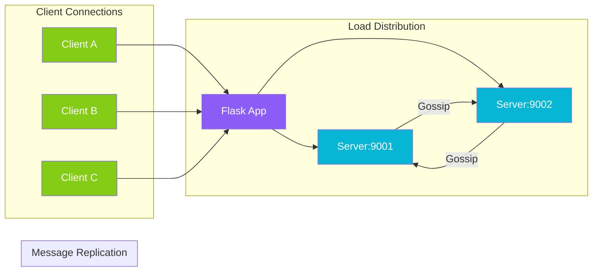

# Real-Time Chat Application

A modern, real-time chat application built with Python Flask, WebSockets, and a multi-node TCP chat server architecture. Features a beautiful responsive UI with Tailwind CSS and real-time messaging capabilities.

## 🏗️ Architecture Overview



## 📦 Project Structure

```
chat-app/
├── app.py                 # Flask HTTP/WebSocket frontend
├── server.py              # Multi-node TCP chat server
├── webpack.config.js      # JavaScript bundling configuration
├── package.json           # Node.js dependencies
├── requirements.txt       # Python dependencies
├── tailwind.config.js     # Tailwind CSS configuration
├── static/
│   ├── css/
│   │   ├── config.css    # Tailwind source
│   │   └── styles.css    # Compiled CSS
│   └── js/
│       └── bundle.js     # Bundled JavaScript
└── templates/
    └── index.html        # Main chat interface
```

## 🚀 Quick Start

### Prerequisites

- Python 3.8+
- Node.js 16+
- npm

### Installation

1. **Clone and setup the project:**
```bash
git clone <repository-url>
cd chat-app
```

2. **Install Python dependencies:**
```bash
pip install -r requirements.txt
```

3. **Install Node.js dependencies:**
```bash
npm install
```

### Running the Application

```bash
# Terminal 1: Start the TCP chat servers
npm run start-server

# Terminal 2: Build and watch for frontend changes
npm run pack & npm run watch

# Terminal 3: Start the Flask frontend
npm run start
```

Or use the individual scripts:

```json
"scripts": {
    "pack": "npx webpack --config webpack.config.js --watch",
    "start": "python app.py",
    "start-server": "python server.py 9001 9002",
    "watch": "tailwindcss -i ./static/css/config.css -o ./static/css/styles.css --watch --minify"
}
```

## 🔧 Detailed Setup

### 1. Python Environment Setup

```bash
# Create virtual environment (optional but recommended)
python -m venv venv
source venv/bin/activate  # On Windows: venv\Scripts\activate

# Install Python packages
pip install flask flask-socketio
```

### 2. Node.js Environment Setup

```bash
# Install all dependencies
npm install

# Development: Watch for changes
npm run watch & npm run pack

# Production: Build once
npx webpack --config webpack.config.js
npx tailwindcss -i ./static/css/config.css -o ./static/css/styles.css --minify
```

## 🎯 Usage

1. **Start all services** using the commands above
2. **Open your browser** to `http://localhost:8080`
3. **Enter a username** and start chatting!
4. **Open multiple browser windows** to test real-time functionality

## 🏗️ System Architecture

### Data Flow



### Multi-Node Communication



## ✨ Features

### Core Features
- ✅ Real-time messaging with WebSockets
- ✅ Multi-node TCP server cluster
- ✅ User join/leave notifications
- ✅ Online user list
- ✅ Message persistence
- ✅ Responsive design

### UI/UX Features
- ✅ Dark/Light mode toggle
- ✅ Message timestamps
- ✅ Typing indicators
- ✅ Sound notifications
- ✅ Message status (sent/pending/failed)
- ✅ Character count
- ✅ Connection status indicator

### Technical Features
- ✅ Fault tolerance with multiple TCP servers
- ✅ Graceful fallback to HTTP polling
- ✅ Automatic reconnection
- ✅ Message deduplication
- ✅ Cross-tab communication

## 🔌 API Endpoints

### HTTP Routes
- `GET /` - Serve chat interface
- `POST /send` - Send chat message
- `GET /poll` - Poll for messages (fallback)
- `GET /health` - Health check

### WebSocket Events
- `connect` - Client connection
- `disconnect` - Client disconnection
- `user_join` - User registration
- `new_message` - Incoming messages
- `user_list_update` - Online users update

## 🛠️ Configuration

### Port Configuration
- **Flask Frontend**: 8080
- **Chat Server 1**: 9001
- **Chat Server 2**: 9002
- **Peer Communication**: 9999

### Environment Variables
```bash
# Optional: Set Flask secret key
export FLASK_SECRET_KEY="your-secret-key"
```

## 🐛 Troubleshooting

### Common Issues

1. **Port already in use**
   ```bash
   # Find and kill process
   lsof -ti:8080 | xargs kill -9
   ```

2. **WebSocket connection fails**
   - Check if Flask-SocketIO is installed
   - Verify no firewall blocking port 8080
   - Check browser console for errors

3. **TCP servers not connecting**
   - Ensure servers are started before frontend
   - Verify ports 9001 and 9002 are available

4. **Frontend not updating**
   - Check if Webpack is running and bundling
   - Verify Tailwind CSS is compiled
   - Check browser console for JavaScript errors

### Debug Mode

Enable debug logging by setting:
```python
# In app.py
logging.basicConfig(level=logging.DEBUG)
```

## 📈 Monitoring

### Health Checks
```bash
curl http://localhost:8080/health
```

### Server Status
Check individual TCP servers:
```bash
telnet localhost 9001
telnet localhost 9002
```

## 🤝 Contributing

1. Fork the repository
2. Create a feature branch
3. Make your changes
4. Test thoroughly
5. Submit a pull request

## 📄 License

This project is licensed under the MIT License - see the LICENSE file for details.

## 🙏 Acknowledgments

- Flask and Flask-SocketIO teams
- Tailwind CSS for the excellent styling framework
- Socket.IO for real-time communication capabilities

---

**Happy Chatting!** 🎉
